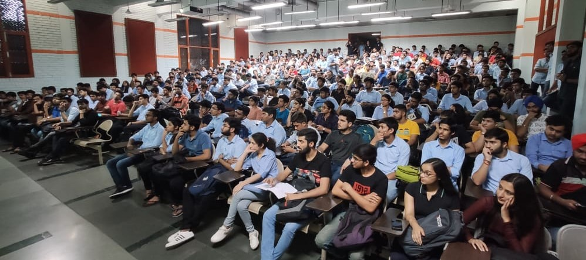
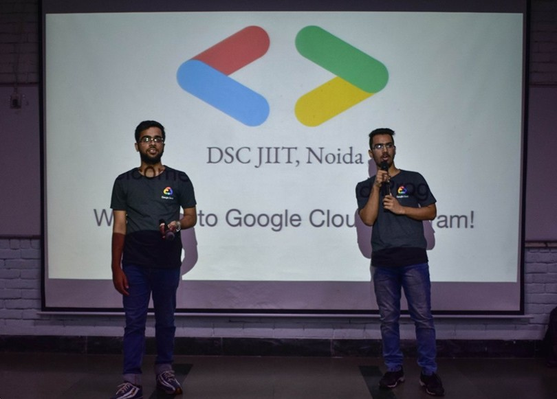
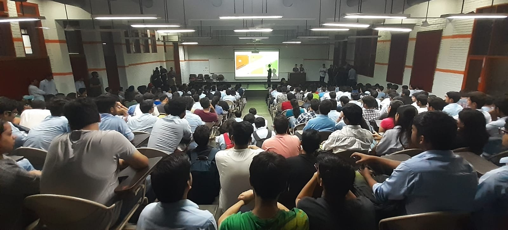

  

# DSC-Google-Cloud-Program-2019

## Introductory Session: 
 - **Date and Time**: 5-8PM, October 3, 2019
 - **Venue**: Lecture-Theatre 3, JIIT Sector-62, Noida

## The Three Tracks

  

## Posts & Blogs

 - [Google-Cloud-Program](https://www.facebook.com/dscjiitnoida/posts/2484650144951729), an introductory post by Developer Student Clubs
 - [Google-Cloud-Program](https://www.linkedin.com/pulse/google-cloud-program-vibhu-agarwal/), a blog post by Vibhu Agarwal

## Gallery

  

  

  

  

Find more photos over [here](https://www.facebook.com/pg/jiitphotography/photos/?tab=album&album_id=2585939788149092&__tn__=-UCH-R)
